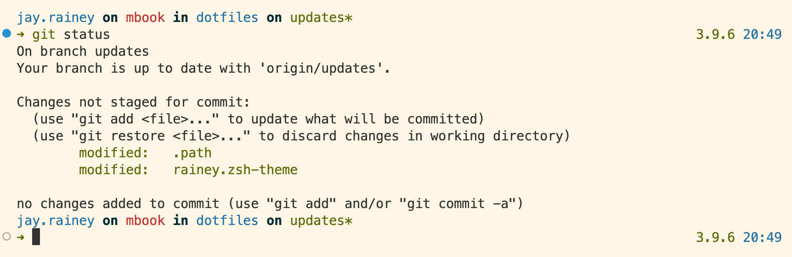

# Dotfiles

> Personal minimalistic configuration files for git, vim, and zsh.



## Dependencies

- [zsh](https://github.com/ohmyzsh/ohmyzsh/wiki/Installing-ZSH#install-and-set-up-zsh-as-default) as default shell.
- [Oh My Zsh](https://github.com/ohmyzsh/ohmyzsh) for sensible defaults.
- [fzf](https://github.com/junegunn/fzf#installation) for fuzzy filtering and filtering zsh history, git, or a directory.
  - [fd](https://github.com/sharkdp/fd) for improved finding and used by fzf.
  - [bat](https://github.com/sharkdp/bat) for syntax highlighting of code in the terminal.
- Notably ZSH plugins:
  - [zsh-ssh](https://github.com/sunlei/zsh-ssh) refined host completion with fzf.
  - [zsh-autosuggestions](https://github.com/zsh-users/zsh-autosuggestions) for autocompletion of prior commands in zsh.
  - [zsh-syntax-highlighting](https://github.com/zsh-users/zsh-syntax-highlighting) syntax highlighting for the shell zsh.
  - [pyenv](https://github.com/ohmyzsh/ohmyzsh/tree/master/plugins/pyenv) loads pyenv and vitualenv if found. This provides access to python version in the prompt.
- (Optional) Solarized terminal as preferred theme on [iterm2 (OSX)](https://github.com/altercation/solarized/tree/master/iterm2-colors-solarized) and [terminator](https://github.com/ghuntley/terminator-solarized).

## Installation & Updating

Before installing you should install all the [dependencies](#installing-dependencies) depending on your OS. Then you can install the dotfiles:

```bash
» git clone http://github.com/jawrainey/dotfiles.git ~/dotfiles
» cd ~/dotfiles && source bootstrap.sh
```

### (Optional) `.extras`

Add any additional configurations will be sourced in `.zshrc`, e.g., git configurations:
```
GIT_AUTHOR_NAME="Forename Surname"
GIT_COMMITTER_NAME="$GIT_AUTHOR_NAME"
git config --global user.name "$GIT_AUTHOR_NAME"

GIT_AUTHOR_EMAIL="email@domain.com"
GIT_COMMITTER_EMAIL="$GIT_AUTHOR_EMAIL"
git config --global user.email "$GIT_AUTHOR_EMAIL"
```

### Proxy Setup

Run [`proxies.sh`](scripts/proxies.sh) to install terminal and docker proxy settings.

```bash
» source scripts/proxies.sh
```

### Installing Dependencies

Dependencies are grouped by type to make each optional, e.g., `linux` deps are not required on OSX.

```bash
# There are no docs so read deps.sh
» source scripts/deps.sh [vim,python,fzf,zshp,linux]
```

## Inspiration

- [Mathias Bynens](https://github.com/mathiasbynens/dotfiles) for his brilliant bash configurations.
- [Jorge Peña](https://github.com/blaenk/dots) for his minimalistic `.vimrc`.
- [Le Wagon](https://github.com/lewagon/dotfiles) for a few aliases.

## License

- Licensed under [MIT](./LICENSE.txt).
